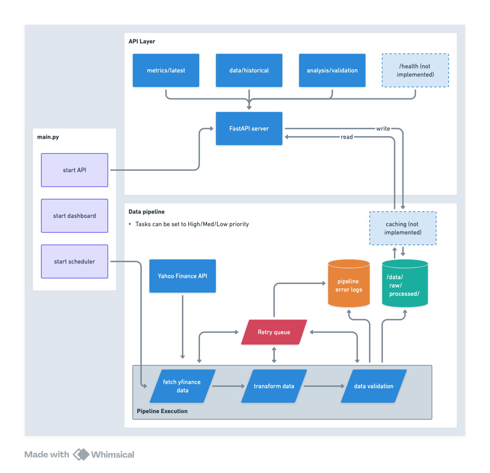

# Market Analysis Pipeline

This was built with a LLM on a Sunday.

It's a data pipeline that fetches $SPY historical data from Yahoo Finance, processes it for technical analysis (SMA, RSI, MACD), and exposes the results through a FastAPI service. The processed data is visualized in real-time via a Streamlit dashboard. Mainly created this project to improve my systems design understanding.

I'm using NetworkX here, which is overengineered for such a linear pipeline (fetch -> transform -> validate -> save), but I do want to look into this more further down the line when I scale out.

## Core Design

The system follows a straightforward design pattern with three main components:
- Data pipeline for SPY ticker analysis
- REST API for data access
- Interactive dashboard for visualization



## Notable Features
- Async execution (but not ureally used at the moment since the pipeline linear)
- Task priority (accepts high/medium/low)

### Pipeline Design
- Task scheduler that handles dependencies through a basic DAG
- Configurable retry logic (default is 3 attempts)
- Validation layer for data quality checks
  - if the RSI range is within expectation
  - if the lowest price does not exceed the highest price
- Standard technical indicators (SMA, RSI, MACD) with configurable parameters

### Configuration
- Centralized config.yaml for:
  - API settings (host, port)
  - Technical indicator parameters (SMA periods, RSI window)
  - Pipeline behavior (retries, timeouts)

### Data Access & Visualization
- REST API built with FastAPI
- Streamlit dashboard
- Error handling and logging

## Technical Notes

## Project Structure
```
├── config/
│   └── config.yaml      # Analysis parameters & settings
├── src/
│   ├── pipeline/       # Core data processing
│   ├── api/           # Data access layer
│   └── dashboard/     # Visualization
└── requirements.txt   # Dependencies
```

## Things I want to try in the future

1. EDA and data streaming (websocket and adding other data sources)
2. Data persistence layer
3. Monitoring and alerts
4. Container deployment
5. API versioning

## Setup & Installation

1. Create and activate virtual environment:
```bash
python -m venv .venv
source .venv/bin/activate  # On Windows: .venv\Scripts\activate
```

2. Install dependencies:
```bash
pip install -r requirements.txt
```

3. Run the pipeline and services:
```bash
python main.py
```

The system will:
- Execute the data pipeline
- Start the FastAPI server (default: http://localhost:8001)
- Launch the Streamlit dashboard
- Note: First run may take longer due to historical data download

# Stack

- Python 3.9+
- FastAPI
- Streamlit
- NetworkX (for dependency handling)
- Pandas/NumPy
- Plotly
- yfinance